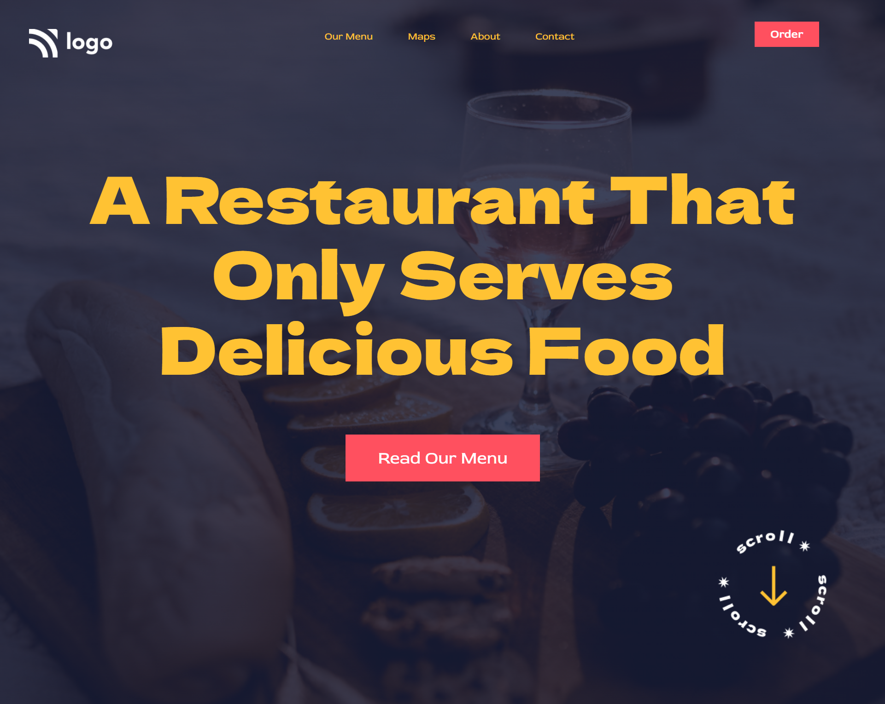

# Project Name : Food Restaurant HomePage 

---

## About Me

**Hey, I'm Yash Pundhir**

- I'm 23 and I live in Hathras, Uttar Pradesh. I'm currently learning **Full Stack Web Development** in `MERN` Stack.

---

## Project Description

- In this project I have built a **Food Restaurant HomePage** from the scratch using core `HTML` & `CSS`

- The **most fascinating part** of the project is that how a `Gradient` can be blended with the `Background Image` to make the overall appearance of the UI more captivating.

- Note that I haven't made it **Responsive** to **Different Screen Sizes**, so it will work only on the laptop screen. If you are using Desktop, please zoom in or out, that might work.

---

## Technologies Used

- HTML

- CSS

---

## What I have Learnt in this Project

- Good Understanding of `HTML` & `CSS`.

- `float` property of CSS:

  - how the `float` property can be used to **align the corresponding elements on the screen wrt the position of the current element**.

- `CSS` Positions:

  - learnt about how the property `position: absolute` can be used to **align an image** at any **desired location** on the entire webpage using the properties: `top, left, right, bottom` by setting the **desired coordinates**.

- **Background** => `(Gradient + Image)`

  - how to use the `background` property in `CSS` to have a **background image** alongwith a **layer of gradient** just above the background image

  - Syntax: 
    ```css 
    background: linear-gradient(color1, color2), url(Image_File_Location);
    ```

  - Note: Both **color1** & **color2** needs to be in `rgba()` format so that the **opacity** of the **gradient colors** can be adjusted accordingly.

---

## Time Taken to Finish this Project

> I took around **2 hours** to complete this project. The only thing that has taken much time to be implemented is how to have a Background that contains **a Gradient and an Image blended together** using `CSS`.

---

I'm definitely more confident now in using a **Background => `(Gradient + Image)` blended together** in my future projects.

---

## Feedback

> For any kind of feedback, please contact me on my email: yash.pundhir.prof@gmail.com

---

## Project Screenshot

> 

---

## You can Check it Live on Below Link :

> [](https://food-restaurant-homepage-sj.netlify.app/)

---